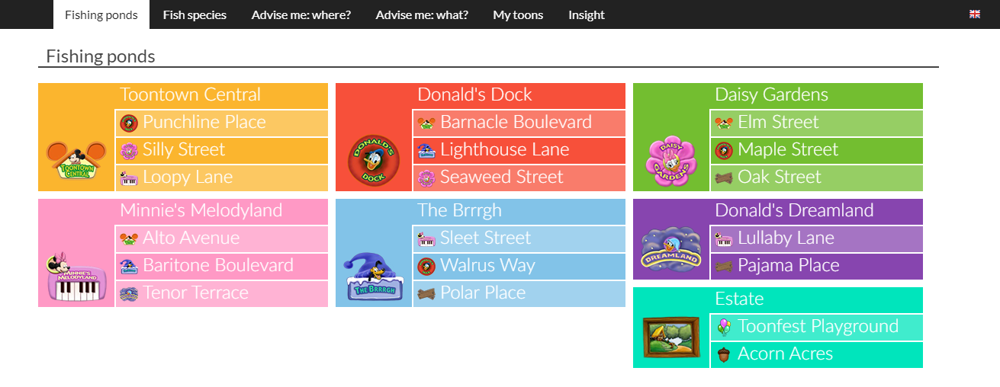
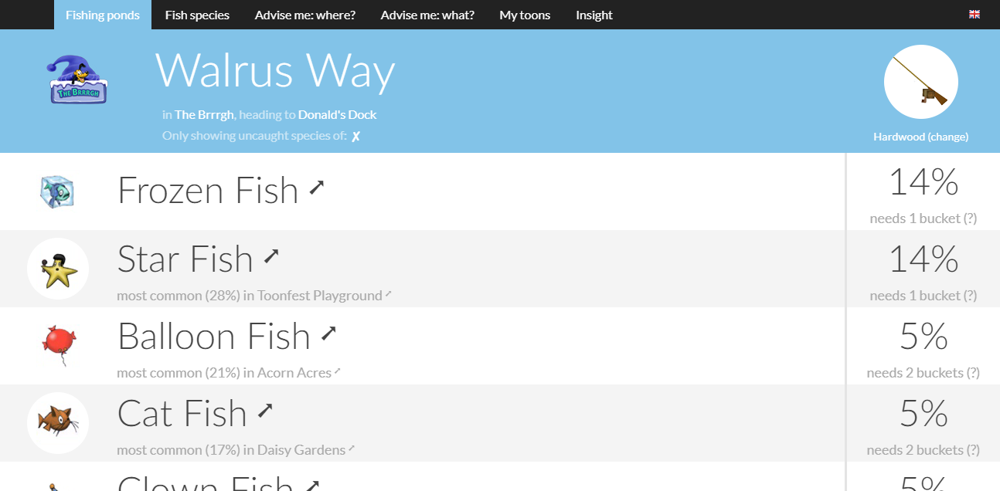
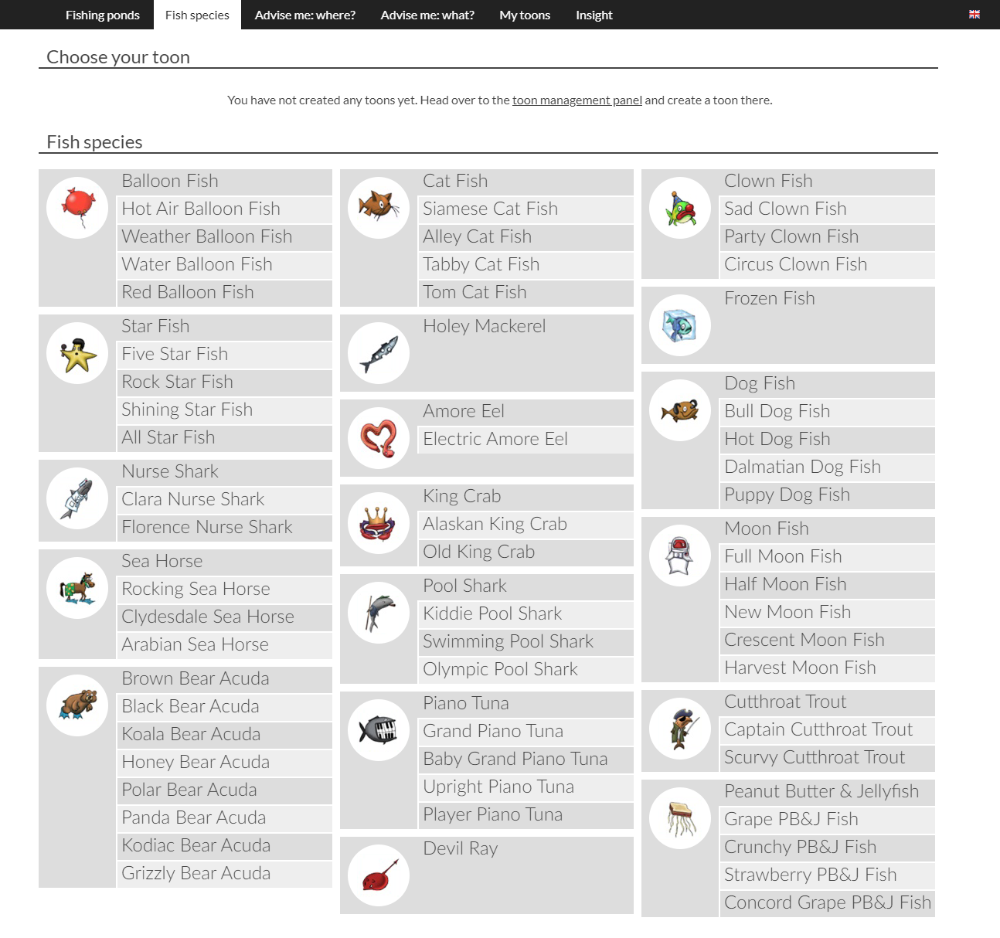
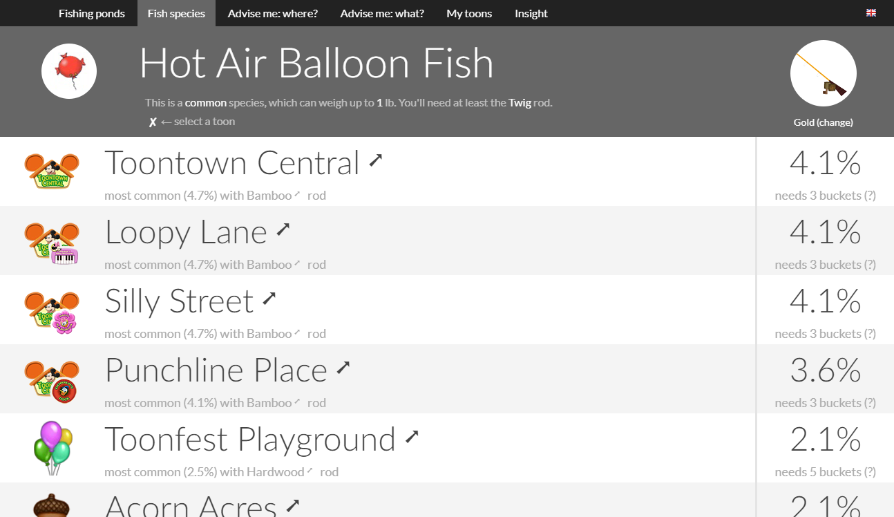
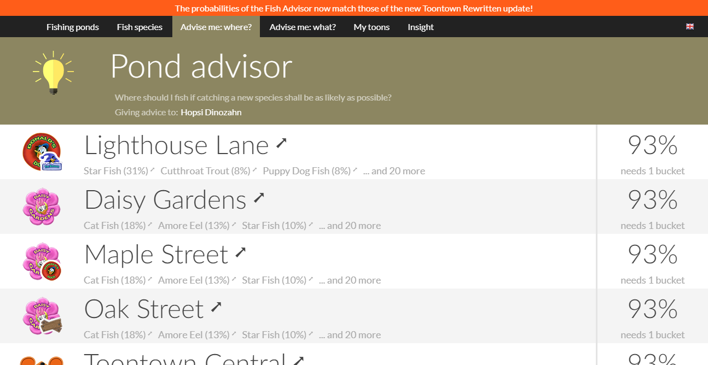
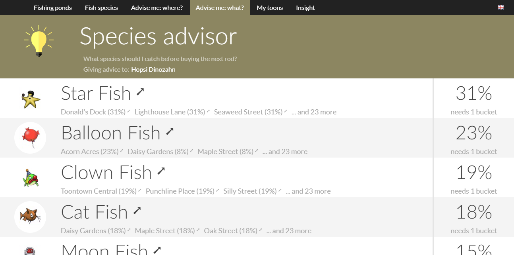
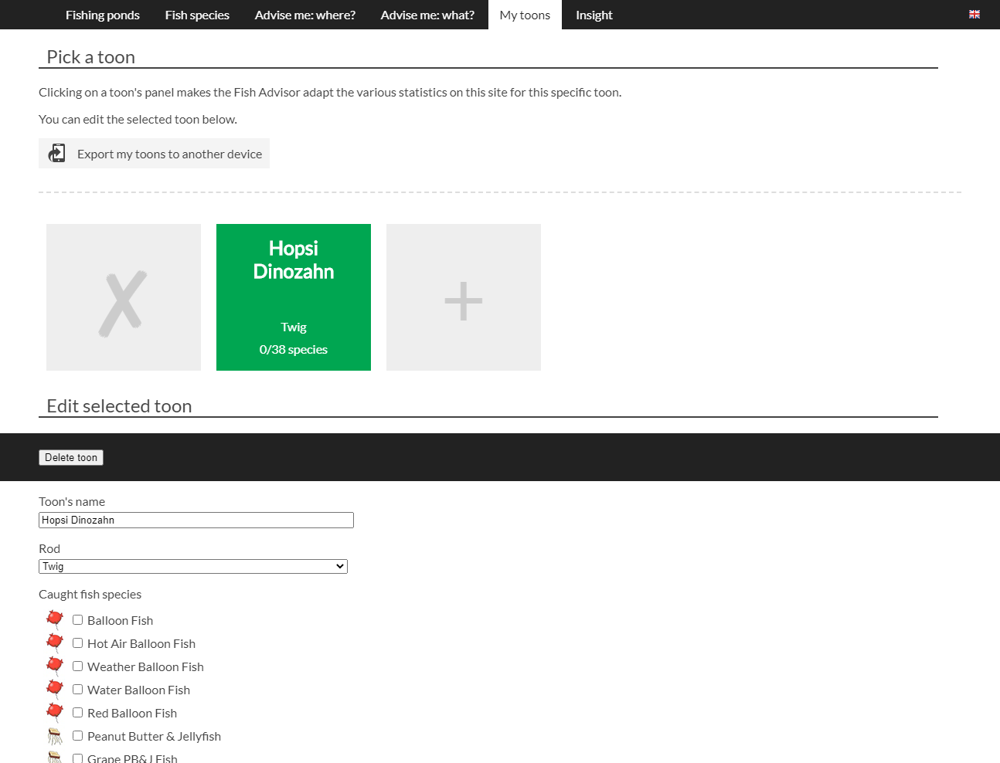

# Fish Advisor

This repository holds the source code for the Fish Advisor website (http://siggen.toontown-click.de/fishadvisor/).

## License

This software is released under the GPL (see [LICENSE file](LICENSE.md)).
That means that any modifications are allowed, but the resulting source code **must be made public and be re-published under the GPL**.

## Screenshots

